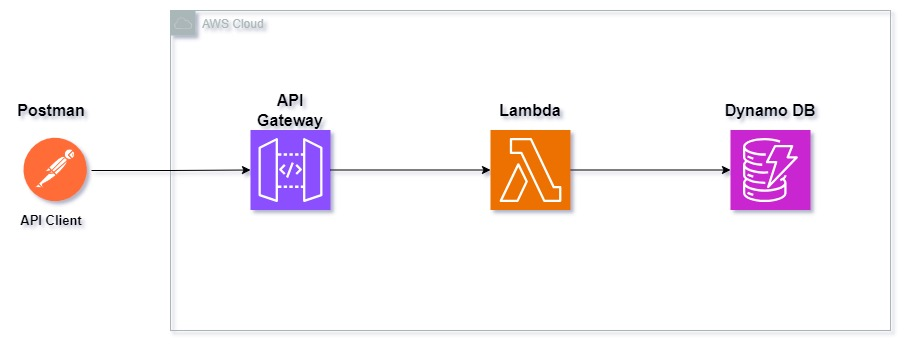

# serverless-api-aws

This is a serverless solution that leverages Amazon Web Services (AWS) to build a sample scalable and cost-effective API in order to get/create/delete products. It uses AWS API Gateway, AWS Lambda, and AWS DynamoDB to mange the API calls, execute the previously mentioned actions, and store the data.

## Diagram

## Components

### AWS API Gateway

The API Gateway serves as the entry point to the serverless API.

### AWS Lambda

Lambda functions are the core of your serverless application. They execute code in response to API Gateway requests. In this solution, the lambda function handle create, get and delete operations.

### AWS DynamoDB

DynamoDB is a fully managed NoSQL database service by AWS. It is used to store and retrieve data related to your serverless application. In this solution, DynamoDB is used to store the products data.

## Steps to deploy the solution

1. Create Lambda function. Code is included under the "serverless-api" folder.
2. Create API Gateway. Please, see sample method configuration below.

3. Create DynamoDB table.

## License

This project is licensed under the MIT License - see the [LICENSE.md](LICENSE.md) file for more details.