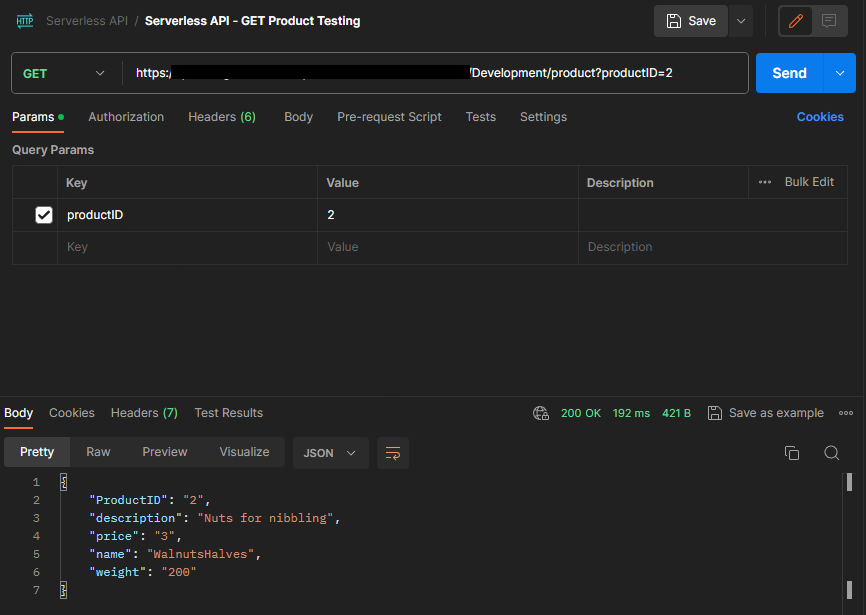
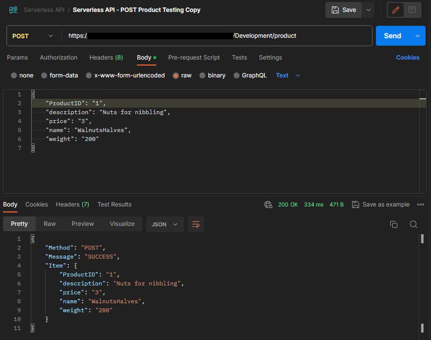
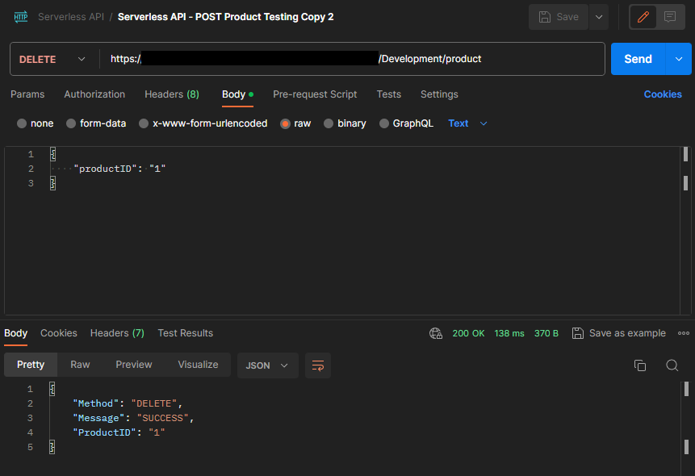

# serverless-api-aws

This is a serverless solution that leverages Amazon Web Services (AWS) to build a sample scalable and cost-effective API in order to get/create/delete products. It uses AWS API Gateway, AWS Lambda, and AWS DynamoDB to mange the API calls, execute the previously mentioned actions, and store the data.

## Table of Contents

- [Diagram](#diagram)
- [Components](#components)
- [Prerequisites](#prerequisites)
- [Deployment](#deployment)
- [Testing the API](#testing-the-api)
- [License](#license)

## Diagram


## Components

### AWS API Gateway

The API Gateway serves as the entry point to the serverless API. As per mentioned above, this is a sample API and authorization/authentication are currently not used for simplication purposes.


### AWS Lambda

Lambda functions are the core of your serverless application. They execute the logic in response to the API Gateway requests. In this solution, the lambda function handle create, get and delete operations.


### AWS DynamoDB

DynamoDB is a fully managed NoSQL database service by AWS. It is used to store and retrieve data related to your serverless application. In this solution, DynamoDB is used to store the products data.


## Prerequisites

Before you begin, if you would like to use this repository, ensure you have the following prerequisites in place:

- **AWS Account**: You must have an AWS account. If you don't have one, you can create one [here](https://aws.amazon.com/).
- **AWS CLI**: Install and configure the AWS Command Line Interface (CLI) with your AWS access and secret keys. You can install the AWS CLI by following the instructions [here](https://aws.amazon.com/cli/).
- **Terraform**: Make sure you have Terraform installed on your local machine. You can download it from [here](https://www.terraform.io/downloads.html).
- **Git**: If you want to clone this repository, you need Git installed. You can download it from [here](https://git-scm.com/downloads).

Finally, note that the Terraform template is by default configured to deploy the resources in the ```eu-west-1``` region, you can easily change this on the second line of the ```main.tf``` file to your preferred AWS region.

## Deployment

To deploy this serverless solution using Terraform, follow the steps below:

1. **Clone the Repository**: Clone this repository to your local environment:

   ```bash
   git clone https://github.com/jasag/serverless-api-aws.git
   ```

2. **Move into the repository folder.**

   ```bash
   cd serverless-api-aws
   ```

3. **Initialize Terraform**: Run the following command to initialize Terraform in your project directory:

   ```bash
   terraform init
   ```

4. **Plan and Apply**: Run the following commands to plan and apply the configuration using Terraform.

   ```bash
   terraform plan
   terraform apply
   ```

5. **Destroy Resources**: Optionally, run the following command to remove all the resources deployed by this Terraform configuration.

   ```bash
   terraform destroy
   ```

### Steps to deploy the solution manually

Alternatively, you can choose to deploy this manually to familiarize further with the services/steps required.

1. Create Lambda function. Code is included under the "serverless-api" folder. Kindly see the screenshots previously provided for mode details.

2. Create API Gateway. Please, see sample method configuration below.


3. Create DynamoDB table.

## Testing the API

### Testing - Get Product



### Testing - Post Product



### Testing - Delete Product



## License

This project is licensed under the MIT License - see the [LICENSE](LICENSE) file for more details.